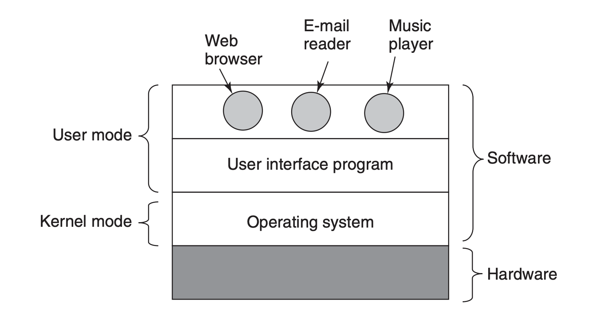
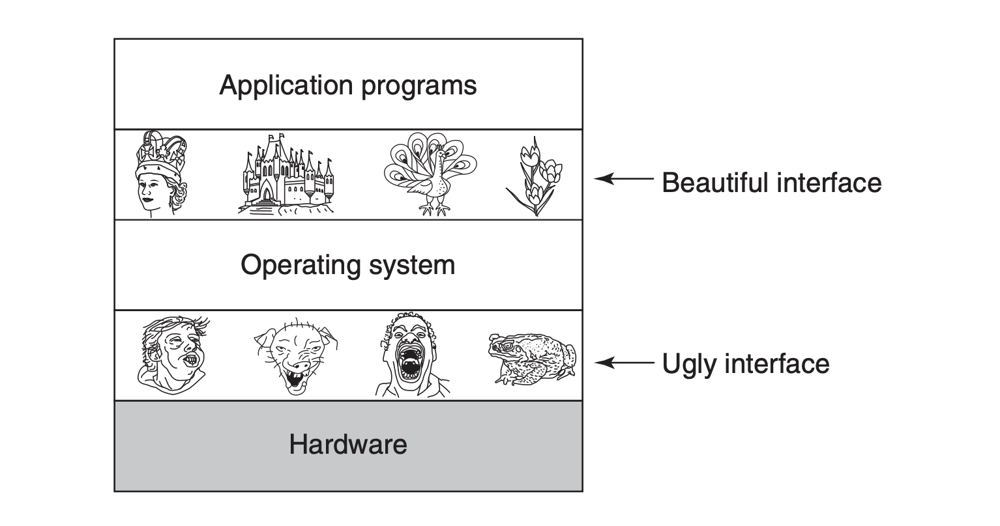

# Introduktion til Teknologifaget og til Commandline Interface´et

Velkommen til jeres først undervisningsdag i Teknologi. I dag bliver en introduktionsdag, hvor i får et overblik over hvad i skal lære i dette semester, og jeg (Claus) får en ide om hvem i er. 

Vi går desuden igang med det første emne, Operativsystemer, og kigger lidt på hvad et operativsystem er og gør. 

På det praktiske plan kommer i til at arbejde med øvelser i skal udføre i jeres Command Line Interface, en applikation der typisk ses som værende et lag under de grafikse brugergrænseflader i normalt bruger. 

## Hvad skal i lære i dette fag?
* Om operativsystemer og deres funktion i forhold til hardware og andet software.
* Kunne kontrollerer jeres computer fra dets CLI (Command Line Interface)
* Databaser 
* Arbejde med Git fra de basale til de mere avancerede dele af dette værktøj.
* Deploye en webapllikation hos en online host.
	* [Eksempel Heroku](https://moviesfrontandback.herokuapp.com/#/movies)
	* [Eksempel GitHub](https://github.com/keanodejs/10_movies_front_and_back)
* Kende til en computers brug af processer og tråde 

## Dagens emne: Operativsystemer

### Hardware

* CPU
* RAM
* HDD
* Grafikkort
* ...

### Computerarkitektur

### Operativsystemet som et smukt interface

## Materialer
* [6 sider om Operativsystemer](https://techkea.github.io/e21/materialer/os_p_1_6.pdf) (Passer til det gennemgåede om OS)
* [Unix terminal commands and file system](https://techkea.github.io/e21/materialer/unix_commands.md)

## Øvelser
* [Command Line Crash Course](https://techkea.github.io/e21/materialer/CommandLineCrashCourse.pdf)
* [Unix Commands Exercises](https://techkea.github.io/e21/materialer/unix_exercises/unix_commands_exercises.html)
