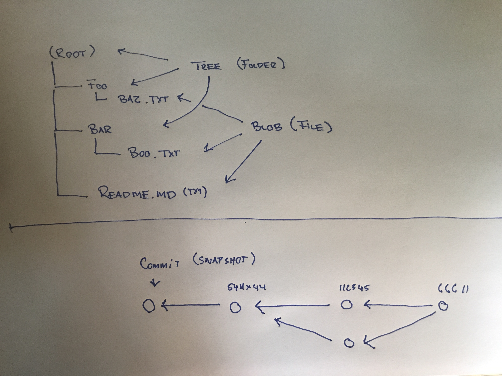

# Versionsstyrring (Git)

## Læringsmål
Efter denne uges undervisning, læsning og øvelser kan du:
* Forstå Gits Datamodel
* Gøre brug af basic kommandoer og relaterer dem til gits datamodel:
	* git help <command>: get help for a git command
	* git init: creates a new git repo, with data stored in the .git directory
	* git status: tells you what’s going on
	* git add <filename>: adds files to staging area
	* git commit: creates a new commit
	* git log: shows a flattened log of history
	* git log ---all ---graph ---decorate: visualizes history as a DAG
	* git checkout <revision>: updates HEAD and current branch
	* git clone: download repository from remote

* Skrive gode og forståelige commit message

## Materialer
* [Git Pro (kap 1 og 2)](https://git-scm.com/book/en/v2)
* [Git's data model](materialer/git_datamodel.md)
* [(Video) Version Control (git)](https://www.youtube.com/watch?v=2sjqTHE0zok)
* [How to Write a Git Commit Message](https://chris.beams.io/posts/git-commit/)

## Øvelser
* [The tree command line tool](materialer/tree_exercise.md)
* [Basic Git øvelse](materialer/git_ex_1.md)
