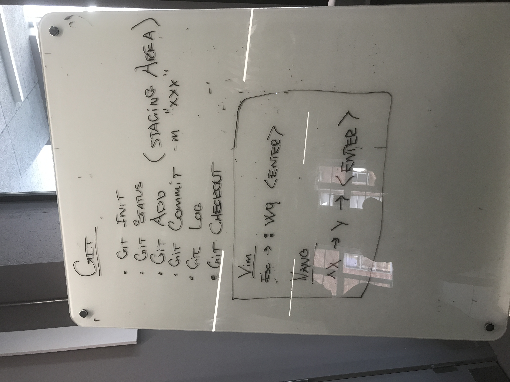

<!-- JS use if these pages are used as githubpages. can be deleted if used elsewhere -->

# GIT CHEAT SHEET

## Basics
- git help <command>: get help for a git command   
- git init: creates a new git repo, with data stored in the .git directory
- git status: tells you what’s going on
- git add <filename>: adds files to staging area
- git commit -m "commit msg": creates a new commit
- git log: shows a flattened log of history
- git checkout <revision>: updates HEAD and current branch

## Branching and merging
- git branch: shows branches
- git branch <name>: creates a branch
- git checkout -b <name>: creates a branch and switches to it
	- same as git branch <name>; git checkout <name>
- git merge <revision>: merges into current branch

## Configuration
- .gitignore: file for specifying which files should not be included in commits
	- [example (simple):](materialer/gitignore_simple.txt)
	- [example (IntelliJ):](materialer/gitignore.txt)

## Remotes (Github)
- git remote: list remotes
- git remote -v: list push and fetch remote url
- git remote set-url <remote> <url>: changes the online repository url
- git push <remote> <local branch>:<remote branch>: send objects to remote, and update remote reference
- git fetch: retrieve objects/references from a remote
- git pull: same as git fetch; git merge
- git clone: download repository from remote
- git branch -r: list remote branches

