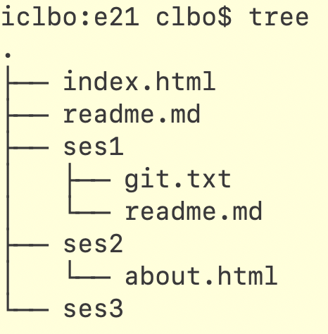

<!-- JS use if these pages are used as githubpages. can be deleted if used elsewhere -->
<script src="https://code.jquery.com/jquery-3.2.1.min.js"></script>
<script src="../script.js"></script>

# The ```` tree ```` command line tool

I denne øvelse skal i installere et lille program som i kan bruge gennem terminalen (Mac: Terminal, Win: Git Bash).

Slutresultatet bliver at i vil kunne se en træstruktureret oversigt over de mapper og filer i har på jeres computer (eller mere præcist i den mappe i er i).



Sidste gang lærte i kommandoen ```` ls ```` for at se en liste af filer og mapper i den mappe i befinder jer i. ```` tree ```` gør det samme med printer det ud i en træstruktur. 
